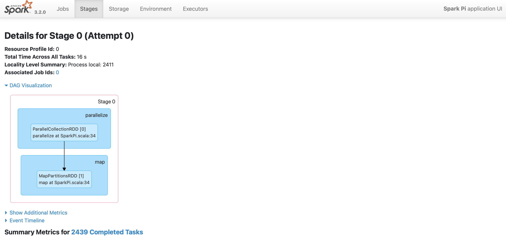

# SPARK Scala on Kubernetes minikube

The process involves you have the following softwares installed in your system.
1. docker
2. kubectl
3. kind


To Validate if you have the necessary softwares installed in your system, run the following command.
```bash
# Docker installation Validation
docker version
# kubectl installtion Validation
kubectl version
# minikube installation Validation
kind version
```

### Steps
1. Create a Kind Cluster
2. Download and unzip Spark Binaries
3. Build docker image
4. Load Docker image in Kind Container Registry
5. Set Spark ServiceAccount roles
6. Submit the spark-pi job
7. Check the spark ui
8. Check Spark logs to see the value of pi

## 1. Create a Kind Cluster
> **Kind:** kind is a tool for running local Kubernetes clusters using Docker container “nodes”.

To create kind cluster run the following command
```cmd
kind create cluster --name spark-cluster
```

Validate Kind Cluster running status by running the below commands
```cmd
kind get clusters

kubectl cluster-info
```


## 2. Download Spark and unzip the binaries
>**Spark:** Apache Spark is a multi-language engine for executing data engineering, data science, and machine learning on single-node machines or clusters.
```bash
# Download the file
curl -o spark-3.2.0-bin-hadoop3.2.tgz https://dlcdn.apache.org/spark/spark-3.2.0/spark-3.2.0-bin-hadoop3.2.tgz
# Unzip the file
tar -xzvf spark-3.2.0-bin-hadoop3.2.tgz
```

## 3. Build Docker image
>**Docker:** Docker is a software framework for building, running, and managing containers on servers and the cloud. 
```bash
docker run -it --rm -v ${PWD}:/work -v //var/run/docker.sock:/var/run/docker.sock -w /work --net host alpine sh
apk add docker-cli
apk add bash
./spark-3.2.0-bin-hadoop3.2/bin/docker-image-tool.sh -r hello-spark -t v1 build
```

## 4. Load Docker image in Kind Container Registry
>**Container Registry:** A container registry is a repository, or collection of repositories, used to store container images for Kubernetes, DevOps,  and container-based application development. 

Run the following command to load the image
```bash
kind load docker-image hello-spark/spark:v1 --name spark-cluster
```


## 5. Set Spark ServiceAccount roles
>**ServiceAccount:** A service account provides an identity for processes that run in a Pod. \
An RBAC Role or ClusterRole contains rules that represent a set of permissions. Permissions are purely additive (there are no "deny" rules).\
A role binding grants the permissions defined in a role to a user or set of users. It holds a list of subjects (users, groups, or service accounts), and a reference to the role being granted. 

Create yaml file called `roles.yaml` and enter the following contents inside the file.
```yaml
apiVersion: rbac.authorization.k8s.io/v1
kind: Role
metadata:
  namespace: default
  name: spark-role
rules:
- apiGroups: [""]
  resources: ["pods", "configmaps", "services", "persistentvolumeclaims"]
  verbs: ["get", "watch", "list", "create", "update", "patch", "delete"]
---
apiVersion: v1
kind: ServiceAccount
metadata:
  labels:
    k8-apps: spark
  name: spark
  namespace: default
---
apiVersion: rbac.authorization.k8s.io/v1
kind: RoleBinding
metadata:
  name: spark-role
roleRef:
  apiGroup: rbac.authorization.k8s.io
  kind: Role
  name: spark-role
subjects:
- kind: ServiceAccount
  name: spark
  namespace: default
```
Add the roles and bind the roles to service accounts
```cmd
kubectl apply -f roles.yaml
```

## 6. Submit the spark-pi job
Run the spark job
```cmd
.\spark-3.2.0-bin-hadoop3.2\bin\spark-submit ^
--master k8s://https://127.0.0.1:51081 ^
--deploy-mode cluster ^
--name spark-pi ^
--class org.apache.spark.examples.SparkPi ^
--conf spark.executor.instances=2 ^
--conf spark.kubernetes.driver.pod.name=spark-pi-driver ^
--conf spark.kubernetes.container.image=hello-spark/spark:v1 ^
--conf spark.kubernetes.container.image.pullPolicy=Never ^
--conf spark.kubernetes.authenticate.driver.serviceAccountName=spark ^
local:///opt/spark/examples/jars/spark-examples_2.12-3.2.0.jar 10000
```
Replace `--master` url with the Kubernetes control plane. You can get the url by running `kubectl cluster-info`. \
List the pods by running `kubectl get pods`
```
NAME                               READY   STATUS    RESTARTS   AGE
spark-pi-4ca1697df1d212cf-exec-2   1/1     Running   0          12s
spark-pi-4ca1697df1d209cf-exec-1   1/1     Running   0          12s
spark-pi-driver                    1/1     Running   0          19s
```

## 7. Check the spark ui
To check the spark ui, port forward from the driver pod.
```bash
kubectl port-forward spark-pi-driver 4041:4041
```
You can see the web-ui by opening the following url `http://localhost:4041` in the browser.


## 8. Check Spark logs to see the value of pi
You can check the spark logs using the following command.
```bash
kubectl logs -f spark-pi-driver
```
```
.
.
.
21/12/25 13:47:45 INFO TaskSetManager: Starting task 9995.0 in stage 0.0 (TID 9995) (172.17.0.7, executor 1, partition 9995, PROCESS_LOCAL, 4597 bytes) taskResourceAssignments Map()
21/12/25 13:47:45 INFO TaskSetManager: Finished task 9994.0 in stage 0.0 (TID 9994) in 12 ms on 172.17.0.7 (executor 1) (9995/10000)
21/12/25 13:47:45 INFO TaskSetManager: Finished task 9995.0 in stage 0.0 (TID 9995) in 10 ms on 172.17.0.7 (executor 1) (9996/10000)
21/12/25 13:47:45 INFO TaskSetManager: Starting task 9996.0 in stage 0.0 (TID 9996) (172.17.0.7, executor 1, partition 9996, PROCESS_LOCAL, 4597 bytes) taskResourceAssignments Map()
21/12/25 13:47:45 INFO TaskSetManager: Starting task 9997.0 in stage 0.0 (TID 9997) (172.17.0.7, executor 1, partition 9997, PROCESS_LOCAL, 4597 bytes) taskResourceAssignments Map()
21/12/25 13:47:45 INFO TaskSetManager: Finished task 9996.0 in stage 0.0 (TID 9996) in 13 ms on 172.17.0.7 (executor 1) (9997/10000)
21/12/25 13:47:45 INFO TaskSetManager: Starting task 9998.0 in stage 0.0 (TID 9998) (172.17.0.7, executor 1, partition 9998, PROCESS_LOCAL, 4597 bytes) taskResourceAssignments Map()
21/12/25 13:47:45 INFO TaskSetManager: Finished task 9997.0 in stage 0.0 (TID 9997) in 11 ms on 172.17.0.7 (executor 1) (9998/10000)
21/12/25 13:47:45 INFO TaskSetManager: Starting task 9999.0 in stage 0.0 (TID 9999) (172.17.0.7, executor 1, partition 9999, PROCESS_LOCAL, 4597 bytes) taskResourceAssignments Map()
21/12/25 13:47:45 INFO TaskSetManager: Finished task 9998.0 in stage 0.0 (TID 9998) in 11 ms on 172.17.0.7 (executor 1) (9999/10000)
21/12/25 13:47:46 INFO TaskSetManager: Finished task 9999.0 in stage 0.0 (TID 9999) in 10 ms on 172.17.0.7 (executor 1) (10000/10000)
21/12/25 13:47:46 INFO DAGScheduler: ResultStage 0 (reduce at SparkPi.scala:38) finished in 117.290 s
21/12/25 13:47:46 INFO TaskSchedulerImpl: Removed TaskSet 0.0, whose tasks have all completed, from pool
21/12/25 13:47:46 INFO DAGScheduler: Job 0 is finished. Cancelling potential speculative or zombie tasks for this job
21/12/25 13:47:46 INFO TaskSchedulerImpl: Killing all running tasks in stage 0: Stage finished
21/12/25 13:47:46 INFO DAGScheduler: Job 0 finished: reduce at SparkPi.scala:38, took 117.699981 s
Pi is roughly 3.1415988631415988
21/12/25 13:47:46 INFO SparkUI: Stopped Spark web UI at http://spark-pi-a351337df1d6ef21-driver-svc.default.svc:4040
21/12/25 13:47:46 INFO KubernetesClusterSchedulerBackend: Shutting down all executors
21/12/25 13:47:46 INFO KubernetesClusterSchedulerBackend$KubernetesDriverEndpoint: Asking each executor to shut down
21/12/25 13:47:46 WARN ExecutorPodsWatchSnapshotSource: Kubernetes client has been closed.
21/12/25 13:47:46 INFO MapOutputTrackerMasterEndpoint: MapOutputTrackerMasterEndpoint stopped!
21/12/25 13:47:46 INFO MemoryStore: MemoryStore cleared
21/12/25 13:47:46 INFO BlockManager: BlockManager stopped
21/12/25 13:47:46 INFO BlockManagerMaster: BlockManagerMaster stopped
21/12/25 13:47:46 INFO OutputCommitCoordinator$OutputCommitCoordinatorEndpoint: OutputCommitCoordinator stopped!
21/12/25 13:47:46 INFO SparkContext: Successfully stopped SparkContext
21/12/25 13:47:46 INFO ShutdownHookManager: Shutdown hook called
21/12/25 13:47:46 INFO ShutdownHookManager: Deleting directory /tmp/spark-8b1bacfe-6fc6-495a-a3d9-d39f20281fa2
21/12/25 13:47:46 INFO ShutdownHookManager: Deleting directory /var/data/spark-552464e0-b19a-48ec-844a-b578d7e1d5b2/spark-6ac995d2-3830-4630-8d70-d1c2ce70f402
```
You can see the result in the logs `Pi is roughly 3.1415988631415988
`